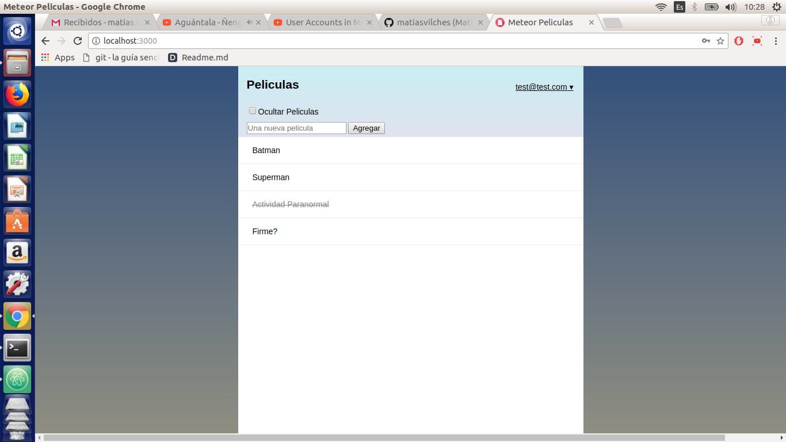

Movies Meteor
=============



**Spanish** / English

Hola, mi nombre es Matías Vilches ([matiasvilches](https://github.com/matiasvilches) en github) y les quiero compartir este proyecto que realicé hace poco. Se trabaja con JavaScript y Meteor, se crea una aplicación web donde puedes administrar tus Peliculas.

Observación: Los textos del proyecto están en español, pero los nombres de las variables están en inglés.

Instalación:
------------
1. Clonar este repositorio con HTTPS.
  	```
  	git clone https://github.com/matiasvilches/movies-meteor.git
  	```

2. Entrar al directorio "movies-meteor"
  	```
  	cd movies-meteor
  	```

3. Ingresar los siguientes comandos.
  	```
  	meteor update
  	meteor npm install
  	meteor npm install --save @babel/runtime
  	meteor npm install --save bcrypt
  	meteor
  	```

4. Jugar con la aplicación web :)

---

Spanish / **English**

Hello, my name is Matías Vilches ([matiasvilches](https://github.com/matiasvilches) in github) and I want to share with you this project I did recently. It works with JavaScript and Meteor, a web application is created where you can manage your movies.

Note: The project texts are in Spanish, but the names of the variables are in English.

Installation:
------------
1. Clone this repository with HTTPS.
  	```
  	git clone https://github.com/matiasvilches/movies-meteor.git
  	```

2. Enter the directory "movies-meteor"
  	```
  	cd movies-meteor
  	```

3. Execute the following commands.
  	```
  	meteor update
  	meteor npm install
  	meteor npm install --save @babel/runtime
  	meteor npm install --save bcrypt
  	meteor
  	```

4. Play with the web application :)
